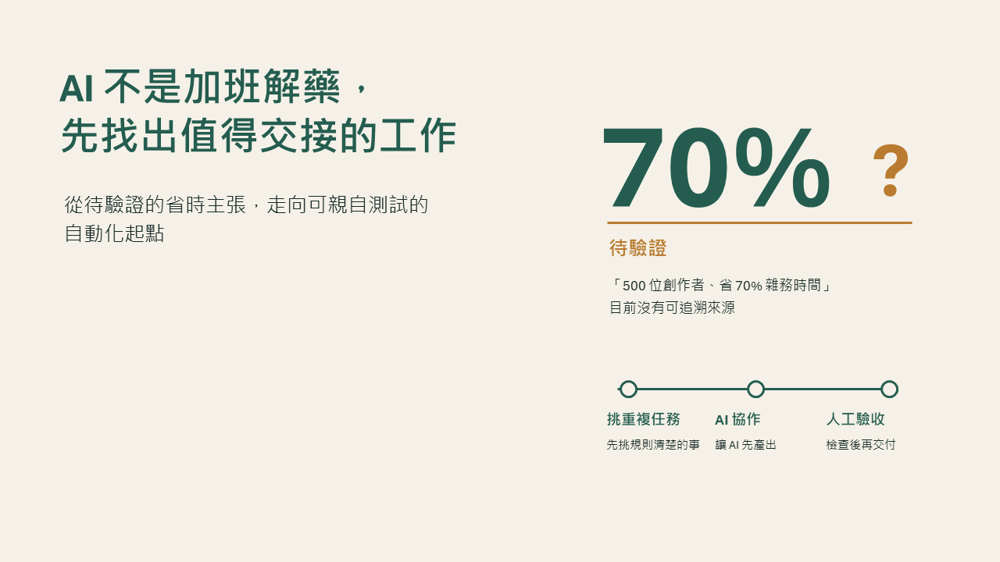
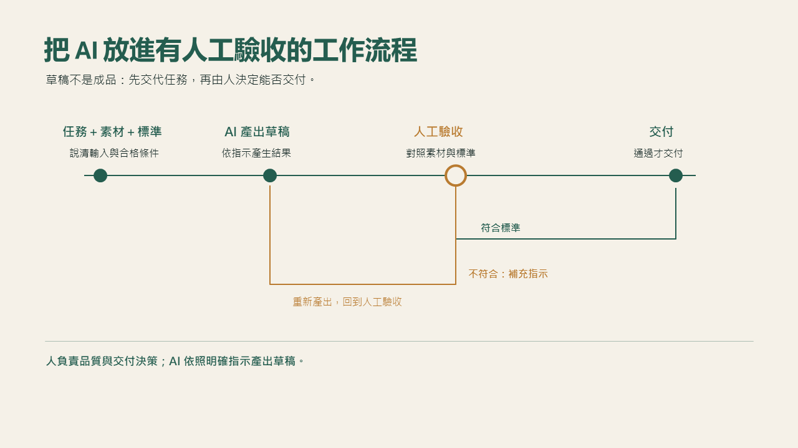
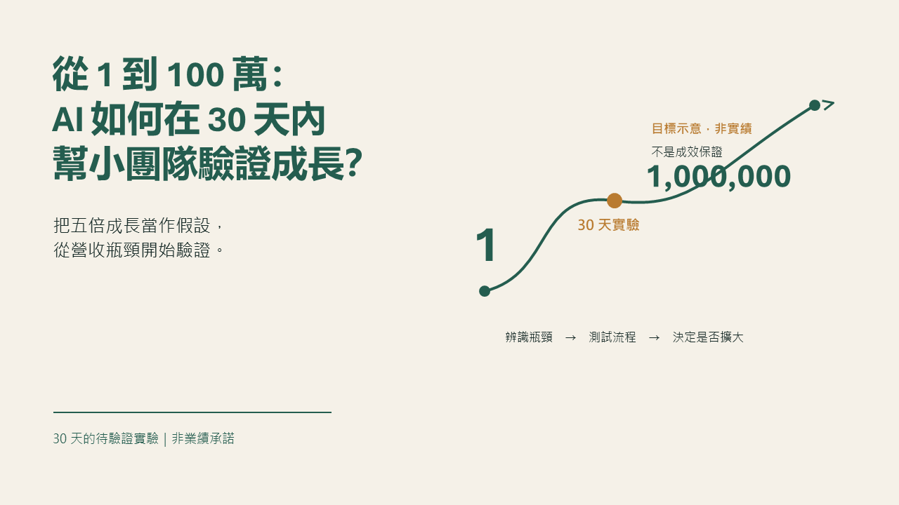
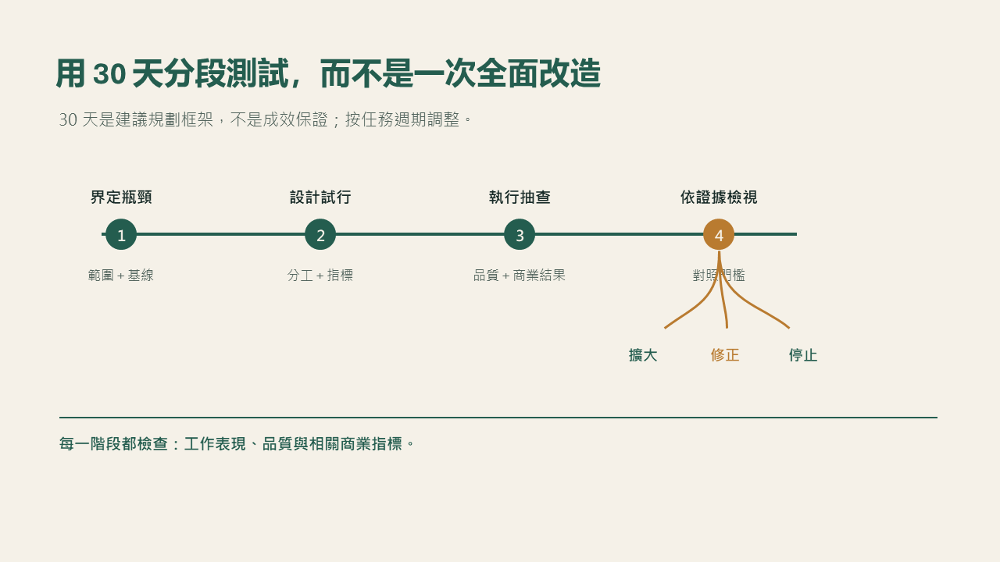
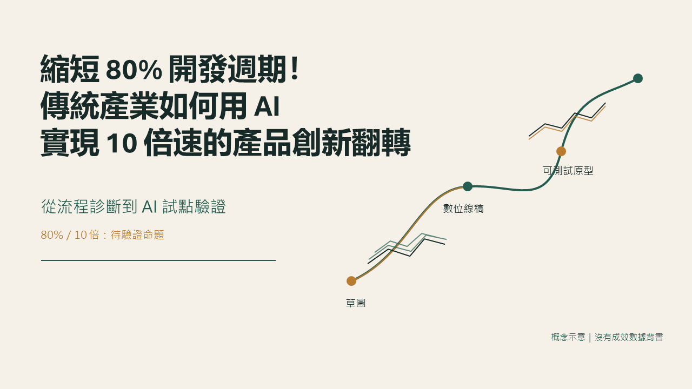
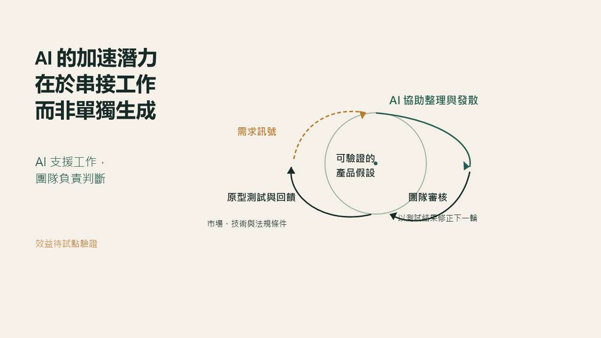

# AutoPPT

**從主題開始，用 AI 做出可編輯、可繼續調整的 PowerPoint。**

AutoPPT 是 Windows 桌面 AI 簡報工作室。你提供主題、對象與目標，依序確認研究來源、大綱和視覺風格，讓 AI 生成投影片與報告講稿。完成後可以逐頁預覽、用對話提出修改，最後匯出 PPTX 或 PDF。

[下載最新版本](https://github.com/SamChengYo/AutoPPT-Releases/releases/latest) · [查看完整範例](examples/2026-10-01/README.md) · [下載 26 張原始截圖](https://github.com/SamChengYo/AutoPPT-Releases/releases/download/v0.8.1/AutoPPT-Examples-2026-10-01.zip)

## 實際生成成果

以下取自 2026-10-01 最近更新的三個 AutoPPT 專案，保留 PowerPoint 實際渲染的 1280 × 720 PNG。點擊圖片可放大；完整圖庫包含每份簡報的所有頁面。

### AI 工作自動化｜9 頁

從重複任務的辨識，整理到有人工驗收的 AI 工作流程與小型試驗。可以看到主題封面、流程圖解及一致的版面風格。

| 主題封面 | 工作流程 |
| --- | --- |
|  |  |

[查看這份簡報的 9 張截圖](examples/2026-10-01/README.md#ai-work-automation)

### 小團隊 AI 營收實驗｜12 頁

把小團隊的 AI 導入整理成瓶頸分析、成效基線與 30 天分段測試。展示較長簡報如何保持內容層次與圖解的一致性。

| 主題封面 | 30 天測試計畫 |
| --- | --- |
|  |  |

[查看這份簡報的 12 張截圖](examples/2026-10-01/README.md#small-team-growth)

### 傳統產業產品創新｜5 頁

用精簡的五頁說明產品開發的等待成本、AI 串接工作與試點驗證。展示封面、正文圖解到結束頁的完整簡報結構。

| 主題封面 | 開發流程圖解 |
| --- | --- |
|  |  |

[查看這份簡報的 5 張截圖](examples/2026-10-01/README.md#product-innovation)

範例中的「70%」「五倍」「80%」等題目數字是簡報討論的待驗證假設，不是 AutoPPT 的成效承諾。三份範例皆使用「森野編輯室」風格，其他風格可在應用程式中選擇。

## 可以做什麼

- **從主題到簡報**：依主題、聽眾與目的整理研究來源，建立大綱，指定總頁數。
- **先確認設計，再生成**：選擇視覺風格並確認逐頁構圖，製作主題封面、正文與呼應封面的結尾。
- **保留可編輯成果**：產出 PowerPoint 文字與圖形物件，方便繼續在 PowerPoint 調整。
- **用對話修改**：檢視投影片後，針對整份簡報或指定頁面提出修改，查看更新後的預覽。
- **講稿與匯出**：講稿保存在 PowerPoint 備註，可匯出 PPTX、PDF 與採用素材的來源紀錄。
- **中斷後繼續**：專案、對話與修改草稿自動儲存在本機。
- **依自己的模板製作**：上傳 `.ppt`／`.pptx`，AI 依大綱複用模板頁，在副本修改內容，沿用原始尺寸、版面、字體與配色。

## 推薦模型：GPT-6 Luna

**第一次使用，建議先選 OpenAI 的 `gpt-6-luna`。** 這也是目前 AutoPPT 的預設 OpenAI 模型。OpenAI 將它定位為適合注重成本、需要大量處理工作的模型，支援文字與圖片輸入；基於這些能力，我們推薦把它作為大綱、逐頁生成與預覽修改的起點。模型能力以 [OpenAI 官方文件](https://developers.openai.com/api/docs/models/gpt-6-luna) 為準。

1. 開啟「模型與設定」，啟用 **OpenAI**。
2. 填入自己的 OpenAI API Key，將模型設為 **`gpt-6-luna`**。
3. 儲存設定，建立新專案，從主題與頁數開始製作。

模型是否可用與費用依你的 API 帳戶及供應商設定為準。AutoPPT 也支援 Anthropic、Gemini 與 DeepSeek；需要看圖的生成與修改流程，請使用支援圖片輸入的模型。

## 下載

前往 [最新版本](https://github.com/SamChengYo/AutoPPT-Releases/releases/latest)，目前版本 **0.9.2**，下載 `AutoPPT-Setup-0.9.2.exe`。本版將設計規劃改為逐頁設計與審查，輸出超限時精簡重試，保留原規劃；既有專案可直接重試設計。詳見[版本說明](versions/v0.9.2.md)。

體驗新版設計流程時，建議建立新專案；既有專案可先在視覺風格按「重新規劃設計」，確認後重新生成。

素材準備保留一般素材上傳，並提供獨立 PPT 模板區（最大 50MB、1–40 頁）；可預覽、更換或移除。模板以可編輯物件為主，圖片內文字不會自動轉為文字框。更換或移除模板後需重新規劃與重建，使用者的來源檔案保持不變。

需要 Windows x64 與 Microsoft PowerPoint。原生 SmartArt 功能另需 Microsoft Excel 元件。安裝程式包含執行所需的 .NET、模型代理服務與 SVG 轉換器，不需另裝 Python；AI 功能需填入自己的供應商 API Key。

## 更新

本版在啟動頁自動檢查與下載更新，下載完成後由使用者選擇「重新啟動並安裝」，顯示安裝進度並於完成後自動開啟。網路失敗可先進入工作室。0.5.0 首次升級仍由舊版自動安裝流程控制；0.3.0 與更舊版可能顯示舊安裝精靈；0.1.0 使用者需手動安裝。

更新保留本機專案及設定。若舊設定無法解密，程式會保留加密備份並提示重新輸入 API Key。解除安裝入口位於應用程式設定，預設保留本機資料。

版本的 `.sha256` 可用於檢查安裝檔完整性；`latest.yml` 與 `.blockmap` 供應用程式更新使用。安裝程式目前未簽章。

## 本倉庫內容

本倉庫提供安裝檔、更新資訊、版本說明與成果展示。應用程式原始碼由獨立的私人倉庫管理。

若之後搬移下載主機，可在 AutoPPT 設定自訂 HTTPS 更新目錄。更新目錄須包含對應安裝檔、blockmap 及最後發布的 `latest.yml`。
